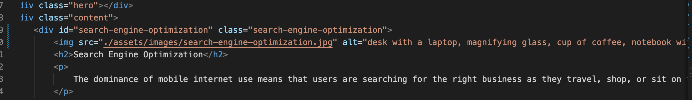

# Code Refactor Starter Code
The purpose of this project was to make this webpage accessible to users. This web page was built by others, but through this 
cousework, I was allowed to add certain elements and attributes to follow the accessibility standards. The clients who build this 
code were not following the accessibility standards. Certain tabs to links were not working and a lot of the image tags were missing 
alternatives. I was able to go into the starter code and make these corrections. 

# Installation
To get started on this project, I needed to clone the starter code repository from GitHub onto my terminal. I then uploaded the
cloned code into visual studio code to begin the code refactoring process.

# Usage
* Add a descriptive title
* Add and id tag to ensure the usage of the link us being used properly
* Add Atl tags to the images in the html file
* Add comments to the css file

Here is a screenshot of how the Search Engine Optimization link now works.

Here is an example of how the ID elements and Alts should be added to the HTML file.

# Credits

https://github.com/coding-boot-camp/urban-octo-telegram.git